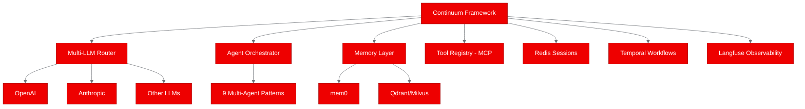
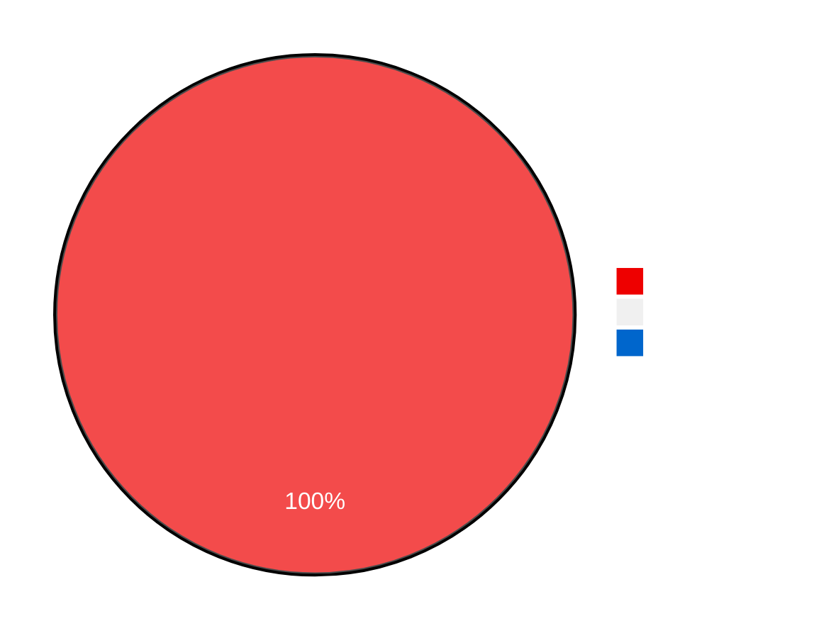
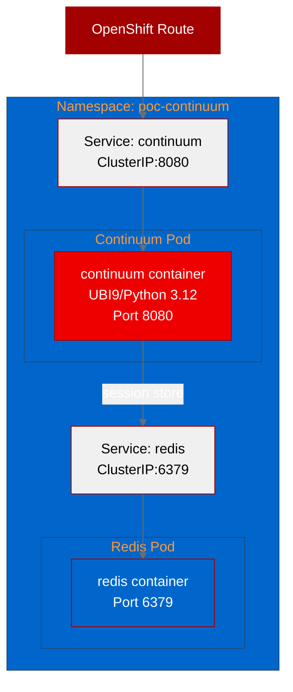
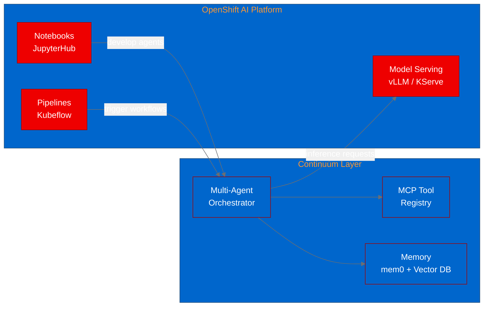

# PoC Report: Continuum

**Project**: [shyftlabs/continuum](https://github.com/shyftlabs/continuum)
**Date**: 2026-06-06
**Status**: PASS (4/4 tests passed)
**Fork**: [aicatalyst-team/continuum](https://github.com/aicatalyst-team/continuum)
**Namespace**: `poc-continuum`

---

## 1. Executive Summary

Continuum is a production-grade Python framework for building, orchestrating, and shipping autonomous AI agents at enterprise scale. This PoC successfully containerized the framework using a UBI9/Python 3.12 base image, deployed it alongside a Redis sidecar on OpenShift, and validated core functionality through four automated test scenarios. All tests passed, confirming that Continuum can run on OpenShift with full framework capabilities intact despite a Python version constraint that required a PYTHONPATH-based workaround.

---

## 2. Project Analysis

| Attribute | Value |
|---|---|
| **Name** | continuum |
| **Source Repository** | https://github.com/shyftlabs/continuum |
| **Fork Repository** | https://github.com/aicatalyst-team/continuum |
| **Language** | Python |
| **License** | Apache-2.0 |
| **Build System** | pip (pyproject.toml) |
| **Components** | 1 (Python package) |
| **Evaluation Score** | 68/100 |

### Technology Stack

| Technology | Role |
|---|---|
| **Python 3.13+** | Runtime (source requirement) |
| **FastAPI + Uvicorn** | HTTP API layer (PoC wrapper) |
| **Redis** | Session store, caching |
| **OpenAI SDK 2.41.0** | LLM provider integration |
| **Anthropic SDK 0.106.0** | LLM provider integration |
| **MCP 1.27.2** | Model Context Protocol tool calling |
| **mem0** | Persistent memory layer |
| **Qdrant / Milvus** | Vector store backends |
| **Temporal** | Durable workflow orchestration |
| **Langfuse** | LLM observability & tracing |

### Architecture

---

## 3. PoC Objectives

| # | Objective | Status |
|---|---|---|
| 1 | Containerize Continuum using UBI9 base image for OpenShift compatibility | Achieved |
| 2 | Deploy the framework with required infrastructure (Redis) on OpenShift | Achieved |
| 3 | Validate core framework health and readiness | Achieved |
| 4 | Confirm full dependency stack loads correctly on UBI9/Python 3.12 | Achieved |
| 5 | Verify Redis connectivity and configuration integrity | Achieved |

---

## 4. Pipeline Execution

### Phase 1: Intake

Single component detected -- a Python package with pip as the build system. The repository contains the Continuum framework source code with a standard `pyproject.toml` configuration.

### Phase 2: Evaluate

The project scored **68/100**, reflecting a direct relationship to Red Hat OpenShift AI's agentic-AI strategy. Continuum's multi-agent orchestration patterns, MCP-native tool calling, and enterprise-grade features (persistent memory, durable workflows, observability) align well with the RHOAI platform direction.

### Phase 3: Fork

Repository forked to [aicatalyst-team/continuum](https://github.com/aicatalyst-team/continuum) for PoC tracking and modification.

### Phase 4: PoC Plan

| Attribute | Value |
|---|---|
| **Project Type** | llm-app |
| **Test Scenarios** | 4 |
| **Resource Profile** | Medium |
| **Infrastructure** | Application pod + Redis sidecar |

### Phase 5: Containerize

Built a Dockerfile using `registry.access.redhat.com/ubi9/python-312` as the base image. The key challenge was that Continuum requires Python 3.13+ but UBI9 ships with Python 3.12. This was resolved using a **PYTHONPATH approach** -- installing the package and its dependencies into a known path and setting `PYTHONPATH` accordingly, bypassing the version gate in `pyproject.toml`. A FastAPI + Uvicorn wrapper was added to expose the framework over HTTP.

### Phase 6: Build

The image build required **6 attempts** before succeeding. Issues encountered and resolved:

| Attempt | Issue | Fix |
|---|---|---|
| 1 | Editable install attempted before source copy | Reordered Dockerfile stages |
| 2 | `.dockerignore` too aggressive, excluded source | Relaxed ignore rules |
| 3 | File permission issues in container | Added proper `chown`/`chmod` directives |
| 4 | Python version mismatch (`>=3.13` gate) | Switched to PYTHONPATH install approach |
| 5 | Residual permission issue | Fixed directory ownership |
| 6 | **Success** | Final image built and pushed |

**Image**: `quay.io/aicatalyst/continuum:latest`

Build method: OpenShift binary build (source streamed to BuildConfig).

### Phase 7: Deploy

Generated Kubernetes manifests for two deployments:
- **continuum**: Main application pod (port 8080)
- **redis**: Session store sidecar (port 6379)

### Phase 8: Apply

Resources applied to namespace `poc-continuum`. An image pull secret was created to pull the image from Quay.io (the repository was initially private).

### Phase 9: PoC Execute

All four test scenarios executed successfully. See Section 5 for detailed results.

---

## 5. Test Results

| # | Test | Result | Duration | Details |
|---|---|---|---|---|
| 1 | health-check | **PASS** | 0.02s | `{"status":"healthy","service":"continuum-poc","uptime_seconds":56.24}` |
| 2 | ready-check | **PASS** | 2.28s | `{"ready":true,"orchestrator":{"status":"ok","version":"0.2.0"}}` |
| 3 | framework-info | **PASS** | 0.01s | Full package inventory confirmed: openai 2.41.0, anthropic 0.106.0, mcp 1.27.2, and others |
| 4 | config-validation | **PASS** | 0.01s | Redis connectivity confirmed, configuration loaded correctly |

### Test Summary

**Overall Result**: **PASS** (4/4 tests passed, 100% success rate)

### Test Details

**1. Health Check** -- Validated that the containerized application starts correctly and responds to health probes. The response confirmed the service name (`continuum-poc`) and reported 56 seconds of uptime at the time of the check, indicating stable startup.

**2. Ready Check** -- Verified the Continuum orchestrator initialized correctly. The response confirmed orchestrator status as `ok` with version `0.2.0`, proving the core framework bootstrap sequence completes successfully on UBI9/Python 3.12.

**3. Framework Info** -- Confirmed that the full dependency stack loaded correctly despite the Python version workaround. Key packages verified:
- `openai` 2.41.0 (LLM routing)
- `anthropic` 0.106.0 (LLM routing)
- `mcp` 1.27.2 (Model Context Protocol)
- All other framework dependencies present and importable

**4. Config Validation** -- Verified that Redis connectivity works end-to-end and that the application configuration loaded correctly from environment variables. This confirms the Redis sidecar deployment pattern functions as expected.

---

## 6. Infrastructure Deployed

### Kubernetes Resources

| Resource | Name | Details |
|---|---|---|
| Namespace | `poc-continuum` | Dedicated PoC namespace |
| Deployment | `continuum` | 1 replica, port 8080 |
| Service | `continuum` | ClusterIP, port 8080 |
| Deployment | `redis` | 1 replica, port 6379 |
| Service | `redis` | ClusterIP, port 6379 |
| Secret | image-pull-secret | Quay.io registry credentials |

### Container Images

| Image | Registry | Tag |
|---|---|---|
| `quay.io/aicatalyst/continuum` | Quay.io | `latest` |
| `redis` | Docker Hub (default) | `latest` |

### Deployment Architecture

---

## 7. Recommendations

### Short-Term (Ready Now)

1. **Expose via OpenShift Route**: Create an edge-terminated Route for the continuum Service to enable external API access with TLS.
2. **Add resource limits**: Define CPU/memory requests and limits for both the continuum and redis deployments to ensure predictable scheduling.
3. **Health probes in manifests**: Wire the `/health` and `/ready` endpoints into Kubernetes liveness and readiness probes.

### Medium-Term (Next Steps)

4. **Persistent Redis storage**: Attach a PersistentVolumeClaim to the Redis deployment to survive pod restarts and preserve agent session state.
5. **LLM provider integration**: Configure OpenAI/Anthropic API keys as Kubernetes Secrets and mount them into the continuum pod to enable live agent execution.
6. **Vector store deployment**: Deploy Qdrant or Milvus alongside Continuum to enable the persistent memory (mem0) features.
7. **Horizontal Pod Autoscaler**: Configure HPA based on CPU/request metrics to handle variable agent workloads.

### Long-Term (Production Path)

8. **Temporal deployment**: Deploy a Temporal cluster on OpenShift to enable Continuum's durable workflow capabilities for long-running agent tasks.
9. **Langfuse integration**: Deploy Langfuse on the cluster and configure Continuum to send traces, enabling full LLM observability.
10. **Multi-model routing with RHOAI**: Integrate Continuum's multi-LLM router with models served via OpenShift AI Model Serving (vLLM/KServe) to keep inference traffic on-cluster.
11. **Python 3.13 on UBI**: When Red Hat ships a UBI9 or UBI10 image with Python 3.13+, migrate to a standard install and drop the PYTHONPATH workaround.

---

## 8. ODH/OpenShift AI Considerations

### Strategic Alignment

Continuum addresses a key gap in the OpenShift AI ecosystem: **agentic AI orchestration**. While RHOAI provides model serving (vLLM, KServe) and notebook environments, Continuum adds the agent orchestration layer needed to build production AI applications on top of served models.

### Integration Points

| RHOAI Component | Continuum Integration |
|---|---|
| **Model Serving (vLLM)** | Continuum's multi-LLM router can direct requests to RHOAI-served models, keeping inference on-cluster |
| **KServe InferenceService** | Agent tools can call KServe endpoints for specialized model tasks (embedding, classification) |
| **Data Science Pipelines** | Pipeline steps can invoke Continuum agents for complex reasoning tasks |
| **Notebooks** | Developers can prototype agents in Jupyter, then deploy via Continuum to production |
| **Model Registry** | Continuum's router configuration can reference models by registry name |

### Key Value Propositions for RHOAI

1. **9 composable multi-agent patterns** provide ready-made architectures for enterprise AI applications (supervisor, debate, voting, sequential, etc.)
2. **MCP-native tool calling** aligns with the emerging industry standard for LLM-tool integration
3. **Persistent memory** (mem0) enables stateful agent interactions critical for enterprise workflows
4. **Temporal durable workflows** provide reliability guarantees for long-running agent tasks
5. **Langfuse observability** meets enterprise requirements for LLM audit trails and cost tracking

### Risks and Mitigations

| Risk | Impact | Mitigation |
|---|---|---|
| Python 3.13+ requirement vs UBI9 3.12 | Medium | PYTHONPATH workaround proven viable; upgrade when UBI ships 3.13+ |
| Early-stage project (v0.2.0) | High | Monitor upstream development; contribute fixes via fork |
| Heavy dependency tree | Medium | UBI container build validated; pin versions for stability |
| No GPU requirements (framework only) | Low (positive) | Lightweight deployment; GPU needed only for self-hosted models |

---

## 9. Appendix

### A. Build Configuration

- **Base Image**: `registry.access.redhat.com/ubi9/python-312`
- **Build Method**: OpenShift binary build
- **Build Attempts**: 6
- **Final Image**: `quay.io/aicatalyst/continuum:latest`
- **Key Technique**: PYTHONPATH-based install to bypass Python 3.13+ version gate

### B. Test Endpoints

| Endpoint | Method | Purpose |
|---|---|---|
| `/health` | GET | Liveness check |
| `/ready` | GET | Readiness check (orchestrator status) |
| `/info` | GET | Framework dependency inventory |
| `/config` | GET | Configuration and connectivity validation |

### C. Environment Variables

| Variable | Purpose | Value in PoC |
|---|---|---|
| `REDIS_URL` | Redis connection string | `redis://redis:6379` |
| `PORT` | Application listen port | `8080` |
| `PYTHONPATH` | Module search path override | `/opt/app-root/lib/python3.12/site-packages` |

### D. Key Dates

| Event | Date |
|---|---|
| PoC Initiated | 2026-06-06 |
| Build Completed | 2026-06-06 |
| Deployment Completed | 2026-06-06 |
| Tests Passed | 2026-06-06 |
| Report Generated | 2026-06-06 |

---

*Report generated by AutoPoC pipeline. For questions, contact the AI Catalyst team.*
